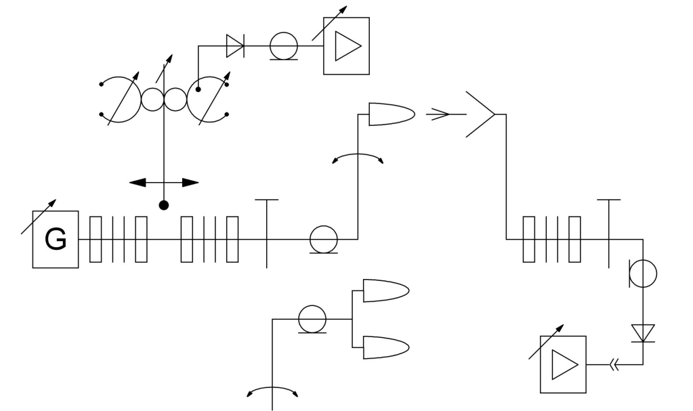
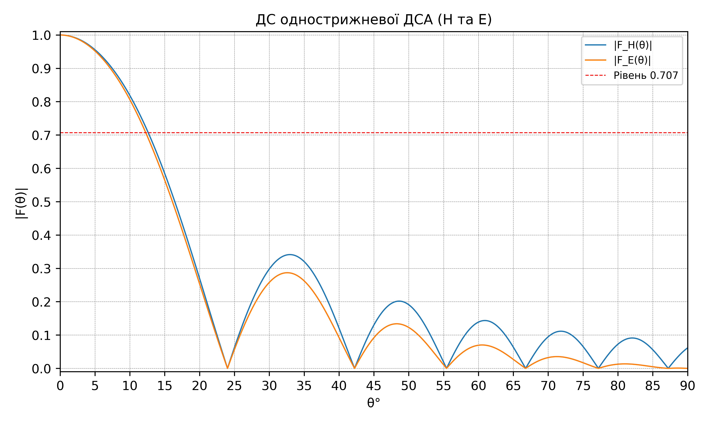
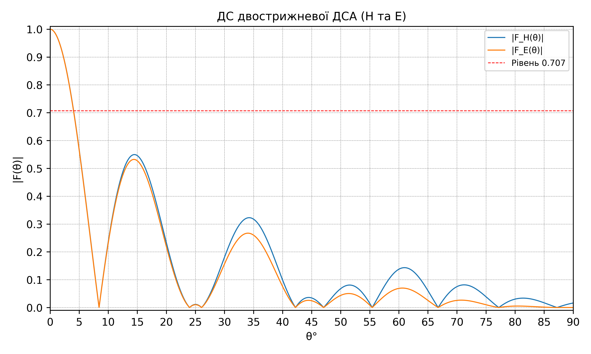

# Лабораторна робота №4
## «Дослідження діелектричної стрижневої антени (ДСА)»

**Виконав:** Чернецький Денис Олександрович, гр. 526-СТ  
**Варіант:** 9

---

## Мета роботи
Ознайомитися з принципом роботи діелектричної стрижневої антени та розрахувати/побудувати нормовані діаграми спрямованості (ДС) для:
- однострижневої ДСА (площини **H** та **E**);
- двострижневої ДСА (площини **H** та **E**),
а також оцінити:
- ширину головної пелюстки на рівні половинної потужності (**0.707**);
- рівень бокових пелюсток.

## Схема лабораторної установки (з методички)

## Вхідні дані (варіант 9)
- Довжина хвилі: **λ = 4.1 см = 0.0410 м**
- Відстань між стрижнями: **h = 14 см = 0.1400 м**
- Довжина стрижня: **l = 23.7 см = 0.2370 м**
- Середній діаметр стрижня: **dср = 2.3 см = 0.0230 м**
- Діелектрична проникність: **εr = 2.2**
- Тангенс кута втрат: **tg δ = 2·10⁻⁴**

## Розрахункові формули
### 1) Вибір коефіцієнта уповільнення
У розрахунку використано наближення з пояснення (формула для оптимального значення):

**ξ = 1 + λ / (2l)**.

Для варіанта 9:
- **ξ = 1.0865**

### 2) Однострижнева ДСА
Множник стрижня:

**Fб(θ) = ((ξ − 1) / sin(πl/λ·(ξ − 1))) · sin(πl/λ·(ξ − cosθ)) / (ξ − cosθ)**.

Нормовані ДС:
- **|F_H(θ)| = |Fб(θ)|**
- **|F_E(θ)| = |Fб(θ)·cosθ|**

### 3) Двострижнева ДСА
Множник ґрат (для синфазної системи з двох випромінювачів):

**Fс(θ) = cos(πh/λ·sinθ)**.

Нормовані ДС:
- **|F_H(θ)| = |Fб(θ)·Fс(θ)|**
- **|F_E(θ)| = |Fб(θ)·Fс(θ)·cosθ|**

## Методика обчислення показників
1. Побудова значень ДС у діапазоні **θ ∈ [0°, 90°]**.
2. Нормування: **F_norm(θ) = F(θ) / max(F(θ))**.
3. Визначення кута половинної потужності: перший перетин рівня **0.707** (лінійна інтерполяція між вузлами сітки).
4. Ширина головної пелюстки: **ШГП = 2·θ₀.₅**.
5. Рівень бокових пелюсток: чисельно як максимум локальних максимумів **після першого нуля** ДС.

## Графіки нормованих ДС
### Однострижнева ДСА

### Двострижнева ДСА

## Результати (зведено)
Детальні числові значення та таблиця:
- `ds_normalized.csv`
- `lab4_report.md`

Ключові результати (рівень 0.707):
- **Однострижнева:** ШГП(H) = **25.27°**, ШГП(E) = **24.56°**
- **Двострижнева:** ШГП(H) = **8.08°**, ШГП(E) = **8.05°**

## Висновки
1. Побудовано нормовані ДС однострижневої та двострижневої ДСА в площинах **H** та **E**.
2. Визначено ширину головної пелюстки на рівні **0.707** (половинна потужність) та оцінено рівні бокових пелюсток.
3. Додавання другого стрижня (множник **Fс(θ)**) звужує головну пелюстку та змінює структуру бокових пелюсток у порівнянні з однострижневою ДСА.

